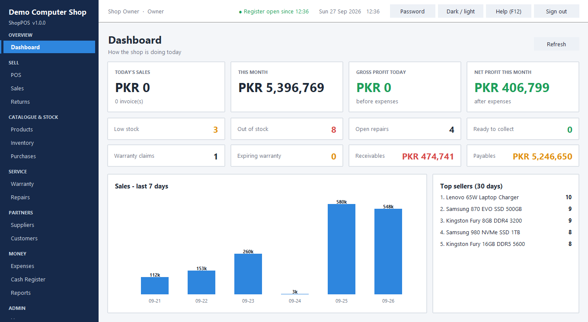
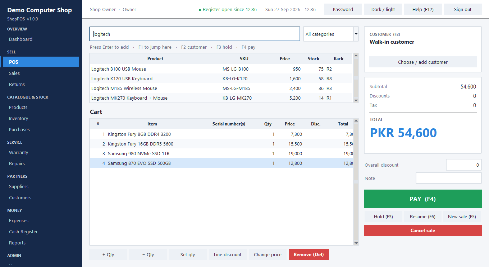
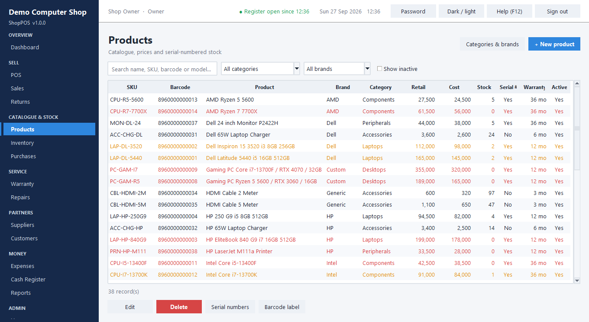
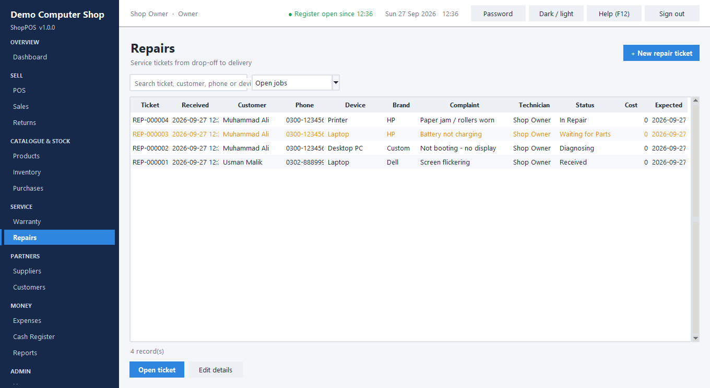
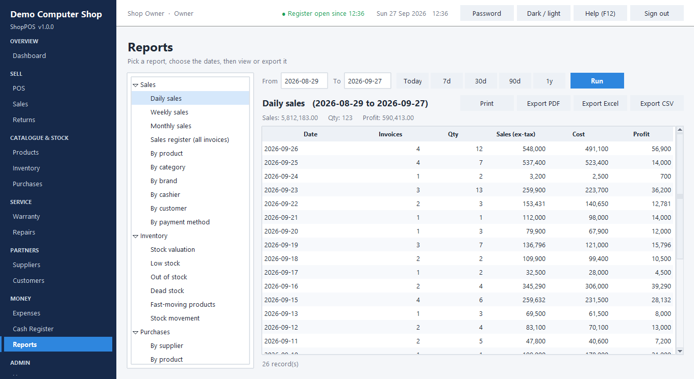

# ShopPOS

A native Windows desktop **POS + inventory + accounting + warranty + repair** system for a computer, laptop and
accessories shop. Offline-first, one `.exe`, no internet and no database server needed.

* Written in **Python** using only the standard library (Tkinter for the window, SQLite for data) -
  there is nothing to `pip install` to run it, and the packaged app needs **no Python, .NET or anything else** on the shop PC.
* ~9,600 lines, 80 automated tests, plus two full UI workflow tests and a 100,000-sale load test (results below).



<table>
<tr>
<td></td>
<td></td>
</tr>
<tr>
<td></td>
<td></td>
</tr>
</table>

## UI/UX

* **Grouped sidebar** (Overview / Sell / Catalogue & Stock / Service / Partners / Money / Admin) with a blue accent
  bar on the active item, so the 18 screens stay easy to scan instead of one long list.
* **Placeholder hints** in every search box (e.g. "Search name, SKU, barcode or model...") so it's clear what to type
  without needing a separate caption label.
* **Empty-state messages** in every table - "No products match your search. Try a different term, or click + New
  product." instead of a blank white grid - and a matching "Cart is empty - scan a barcode or search above" message
  on the POS screen.
* Toast notifications now carry a ✓ / ✕ / ! icon so success, error and warning are distinguishable at a glance.
* Verified in both the light and dark theme (screenshots checked pixel-by-pixel, not just by eye).

## Install and run (shop owner)

1. Run **`dist\ShopPOS-Setup.exe`** - it installs for the current Windows user (no administrator password),
   creates the Desktop and Start Menu shortcuts, creates the data folders and the database, and starts the app.
   *(Windows may show a "SmartScreen / unknown publisher" warning because the installer is not code-signed - choose
   "More info -> Run anyway". Signing needs a paid certificate.)*
2. Sign in with **`admin` / `admin123`** - you are asked to choose a new password immediately.
3. On first start the Owner is offered **demo data** (sample laptops, PCs, parts, customers, sales, repairs). Delete it
   before going live from **Settings -> Data -> Delete all business data**.

Prefer no installer? Copy the folder `dist\ShopPOS\` anywhere and run `ShopPOS.exe` (portable).

Everything the shop creates lives in `%LocalAppData%\ShopPOS\` - `pos.db` (database), `Backups\`, `Logs\`,
`Invoices\`, `Exports\`, `Images\` - separate from the program files, so updating or uninstalling never touches it.

## Run from source / build (developer)

```bat
python main.py                 rem run directly (Python 3.10+ with Tk; nothing to install)
python -m unittest discover -s tests
python tests\ui_smoke.py       rem drives the real window through POS, hold/resume, split payment, cancel, timeout
python tests\perf_check.py     rem 10k products / 100k sales / 520k stock transactions (about 90 s)
build_exe.bat                  rem builds dist\ShopPOS\ + dist\ShopPOS-Setup.exe and self-tests them
```

`build_exe.bat` creates an isolated `.venv-build`, installs PyInstaller there, draws the icon, builds the app, runs the
packaged `ShopPOS.exe --selftest` (creates a DB, loads demo data, checks integrity, renders PDF/XLSX/CSV, opens
a Tk window) and then builds the installer. `ShopPOS.exe --init` creates/upgrades the database only.

## Screens (all working, none are placeholders)

| Screen | What you can do |
|---|---|
| **Dashboard** | Today/month sales, gross & net profit (if permitted), low/out-of-stock, open repairs, ready-to-collect, warranty claims/expiring, receivables/payables, 7-day chart, top sellers |
| **POS** | Scan barcode / SKU / **serial number**, search by name/model, category filter, quantity +/-/set, line discount, overall discount, price override (permission), customer pick/create, notes, **hold / resume**, cancel, **split payments** (cash, bank, card, wallet, store credit, credit), change due, receipt print/preview, A4 PDF invoice |
| **Products** | Full product record (SKU, barcode, brand, category + subcategory, model, 4 prices, stock, min stock, warranty, tax, discount, supplier, image path, rack, location, serialized, active); unique SKU/barcode; auto-generated barcodes; serial-number list per product; barcode label sheets; categories & brands manager |
| **Inventory** | Current / reserved / available / damaged / sold / low / out, stock value, adjustments (reason required), mark damaged, complete movement history, integrity check |
| **Purchases** | Purchase order -> (partial) goods receiving with serial numbers -> stock + weighted-average cost -> supplier payable -> payment; purchase returns; cancel PO |
| **Suppliers / Customers** | Profiles, opening balance, credit limit, totals, outstanding balance, running ledger/statement, receive/make payments, purchase history |
| **Sales** | Search by invoice/customer/phone/date/status, receipt reprint, A4 PDF, cancel (reverses stock, serials, warranty, credit, cash), start a return |
| **Returns** | Find invoice -> partial/full/serialized returns with **serial verification**, Good/Damaged condition, refund by cash/bank/card/wallet/store credit, credit sales reduce the customer balance first, exchange |
| **Warranty** | Auto-created at sale (per serial). Lookup by serial / invoice / phone / product. Active, Expiring Soon, Expired, Claimed, Replaced. Claims: repaired / replaced (assigns a replacement serial, adjusts stock) / rejected |
| **Repairs** | Tickets (device, brand, model, serial, complaint, condition, accessories, technician, estimate), status flow, technician notes, parts consumed (deducted from stock), labor, deliver + collect payment (or on credit), ticket slip |
| **Expenses** | Categories (Rent, Electricity, Internet, Salaries, Transport, Marketing, Maintenance, Office, Other + your own), cash expenses hit the register |
| **Cash Register** | Open with float, cash sales/refunds/expenses/supplier & customer payments, deposits/withdrawals, close with expected vs actual and **variance**, daily cash report, history |
| **Reports** | 26 reports (sales by day/week/month/product/category/brand/cashier/customer/payment method; stock valuation, low, out, dead, fast-moving, movement; purchases by supplier/product/date; profit & loss, receivables, payables; pending/completed repairs, technician performance, repair revenue) - export **PDF / Excel / CSV** |
| **Users** | Users, 8 roles (Owner, Admin, Manager, Cashier, Inventory Manager, Accountant, Sales Staff, Technician), 30 configurable permissions per role, password reset |
| **Audit Log** | Logins, product/price/customer/supplier changes, sales, cancellations, returns, stock adjustments, purchases, payments, permission changes - with old/new values |
| **Settings** | Business details, logo, invoice prefix/terms, POS options, inventory options, receipt/A4/label printer, session timeout, demo data / clear data |
| **Backup & Restore** | Manual, automatic daily, on-close, choose folder (e.g. `D:\POS Backups`), keep N, restore from list or file. A backup is **never overwritten**; restoring first saves a `pre-restore` copy |

### Keyboard (POS)
`F1` search/scan - `F2` customer - `F3` hold - `F4` pay - `F5` new sale - `F6` resume - `Del` remove line -
`Enter` confirm - `Esc` close dialog - `F12` help. A USB barcode scanner needs no setup: it types like a keyboard,
and the POS routes stray scanner characters into the search box even if focus is elsewhere.

## Business rules enforced (and tested)

Cannot sell more than available stock (unless you enable negative stock) - serialized items need a serial per unit -
serial numbers, SKUs, barcodes and invoice numbers are unique - returned serials are verified against the invoice -
cancelled sales reverse stock/serials/warranty/credit/cash - every stock change writes an inventory transaction and
needs a reason when manual - profit uses **actual cost** (serial cost or weighted-average cost) after discounts and
returns - credit sales raise customer receivables, credit purchases raise supplier payables - the cash register
reconciles (expected = opening + cash in - cash out) - sensitive actions check permissions.
A completed sale is **one database transaction**: sale, items, payments, stock, inventory log, warranty, ledger and
cash entries commit together or roll back together.

## Architecture

```
main.py                     entry point (--selftest, --init)
shoppos/config.py           paths, roles, permission catalogue, default settings
shoppos/db.py, migrations.py  SQLite wrapper (nested transactions), versioned migrations (V1 schema, V2 indexes)
shoppos/services/*.py       ALL business logic (auth, catalog, inventory, purchasing, sales, returns, warranty,
                            repairs, finance, parties, reports, export, printing, barcode, backup, demo, pdf, audit)
shoppos/ui/                 Tkinter UI only: app shell, theme (light/dark), widgets, 18 screens - no business logic
tests/                      unit tests, UI workflow test, load test, screenshot tools
tools/                      icon generator, installer (setup wizard) builder
```

The UI never writes SQL; it calls services, which take the acting user and enforce permissions - so the same rules
apply from any future front end (web, API, sync). Money is stored as 2-decimal values, rounded with half-up rules.

## Test results

| Suite | Result |
|---|---|
| `python -m unittest discover -s tests` | **80 tests pass** (login/lockout/hashing, permissions, products, barcode, serials, purchases, inventory, sale, payment, split payment, credit limits, discounts/tax allocation, returns/refunds/store credit/exchange, warranty, repairs, expenses, cash register variance, profit calculation, atomic rollback, backup, restore, exports, PDF/receipt) |
| `tests\ui_smoke.py` | **21 checks pass** - real window, all 18 screens, scan/serial/hold/resume/split-pay/cancel through screen code, theme, session timeout |
| `tests\ui_full.py` | **73 checks pass** - every module driven through its actual screen code (not just the service layer): products (create/edit/delete/serials/barcode labels/categories), inventory (adjust/damage/movements), suppliers & customers (create/edit/pay/ledger), purchases (order/receive with serials/pay/cancel/return-to-supplier), sales returns (partial, serialized, store credit), warranty (claim/resolve), repairs (ticket/status/parts/labor/notes/deliver), expenses, cash register (deposit/withdraw/close with zero variance/reopen), reports (run + export CSV/Excel/PDF), users & role permissions, audit log, settings, backup - finishing with a full inventory + ledger consistency check |
| `tests\perf_check.py` (10,000 products, 100,000 sales, 520,000 stock transactions) | POS scan **0.3 ms**, product search **8 ms**, sales list **10-110 ms**, dashboard **30 ms**, heaviest whole-year report **0.74 s** |
| Packaged build | `ShopPOS.exe --selftest` passes; silent install -> files + DB + folders -> installed exe self-test -> uninstall (app removed, data kept) all verified; GUI exe launches and responds |

## Honest limitations (please read)

* **Not verified on real shop hardware.** No scanner, thermal printer, label printer or cash drawer was available.
  Scanners work as keyboards (tested by simulating scans). 80mm receipts are printed as plain text through Windows
  (`notepad /pt` to the printer you choose in Settings); A4 invoices/reports open as PDF. Direct ESC/POS commands and
  **cash-drawer kick pulses are not implemented** - configure "open drawer on print" in the printer driver instead.
  Barcode labels are Code 39 (any scanner reads it) printed from a browser page, not a native label-printer language.
* **Not tested on a clean Windows install / VM** - only on this PC (Windows 11) in sandbox folders. The installer is
  unsigned (SmartScreen prompt).
* **Single computer.** SQLite on one PC. Several terminals sharing one database over a network share are not supported.
* **Multi-store is schema-ready only**: branches, warehouses, stock-transfer tables and `branch_id` columns exist, but
  there is no branch/warehouse UI, per-warehouse stock or transfer workflow yet. Product **variants** are also table-only
  (use separate SKUs for variants for now).
* **Not implemented**: e-mailing invoices, cloud backup/sync and auto-update (the spec's optional online features),
  multi-language UI (English only), product images are stored as a path but not displayed, EAN-13/Code 128 barcodes.
* Reports attribute sales-return effects to the original sale in "by product/category/..." reports, and to the return
  date in the Profit & Loss summary (standard cash-basis treatment).

## Security notes

Passwords are PBKDF2-SHA256 (200,000 iterations, per-user salt). 5 failed sign-ins lock the account for 5 minutes.
Idle sessions sign out (default 15 min, configurable). All SQL is parameterised. The database file itself is **not
encrypted** - protect the PC with a Windows account password/BitLocker.
